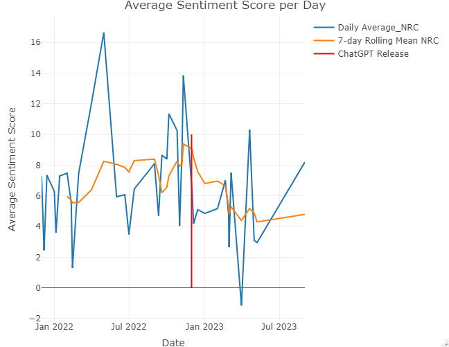
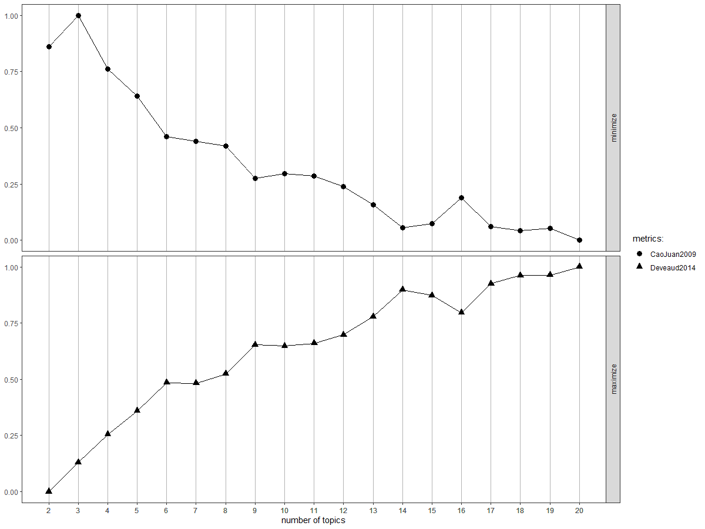

# 1. Introduction

Artificial Intelligence (AI) has been widely studied and researched over the years, and nowadays the AI technology influences not only businesses but also individuals. Modern society is now closely entangled with the developed technology. Experts have long emphasized that AI has the potential to be a game changer, and this viewpoint has been widely embraced by academia and industry. However, the emergence of ChatGPT, a chatbot developed by OpenAI, has surprised the world with its power, unleashing unforeseen and unpredictable effects. The value of ChatGPT seems to surpass our imaginations. Tremendous amounts of people, even at this current moment, benefit from its incredible advantages [3]. Ironically, despite its vast potential, ChatGPT has also brought about negative consequences. One example is found in the tragic earthquake that happened in Turkey and Syria, where scammers exploited generative AI technology to fabricate a fake image of a firefighter holding a victim to trick people into donating money.


Source: Hannah Gelbart, "Scammers profit from Turkey-Syria earthquake" in BBC, 14 Feb 2023
	
[1] examines the discourse and sentiment surrounding ChatGPT since its release in November of 2022. The analysis is based on over 300,000 tweets and more than 150 scientific articles. The motivation of the study comes from that, while there is a lot of anecdotal evidence regarding ChatGPT’s perception, there have not been many studies that analyse different sources such as social media and scientific papers.

The study result indicates that the sentiment around ChatGPT is generally positive on social media. Recent scientific papers depict ChatGPT as a remarkable prospect in diverse domains, particularly in the medical field. However, it is also regarded as an ethical concern and receives mixed evaluations in the context of education. ChatGPT can be an opportunity to make writing more efficient, but at the same time could pose a threat to academic integrity.

The perception of ChatGPT has slightly decreased since its debut. Moreover, the sentiment varies among different languages, with English tweets having the most positive views of ChatGPT. The content of positive sentiment focuses on admiration of ChatGPT’s abilities, while negative sentiment expresses concerns about potential inaccuracies, detectability of AI-generated text, potential job loss and ethical concerns. Overall, the analysis suggests that the sentiment about AI, specifically ChatGPT, has changed since its launch, with a decrease in overall sentiment and a shift towards more rational views.

The debate about a proper usage of AI is intensely led by leading AI experts and leaves challenging questions to the public. Geoffrey Hinton, who has been named as AI pioneer or Godfather of AI, has recently decided to leave Google with regrets and fears about his life’s work in AI. This circumstance may indicate that the sentiment of AI has changed dramatically ever since the birth of ChatGPT. Besides, the problem is that such discussions are done among the experts and hence their voices are likely to influence public opinions towards the AI technology.
	

Source: Cade Metz, "The Godfather of A.I.’ Leaves Google and Warns of Danger Ahead" in New York Times

[2] aims to explore the public perception of risks associated with AI. The authors analyse twitter data and investigate the emergence and prevalence of risks associated with AI. A significant finding is that the perception of AI risk is primarily linked to existential risks, which gained popularity after late 2014. This perception is primarily influenced by expert opinions rather than actual disasters.

According to the authors, experts tend to hold three different positions regarding technology: antagonists, pragmatists or neutrals, and enthusiastic experts. Antagonists believe that achieving human-level AI is insurmountable, rendering related risk scenarios nonsensical. Pragmatists or neutrals find it challenging to identify the actual challenges in developing human-level AI but recognize short-term risks associated with existing technology. Enthusiastic experts believe that full development is inevitable but can lead to either positive or negative outcomes, with pessimistic enthusiasts framing existential risk scenarios. The study suggests that pessimistic experts can indirectly influence society by amplifying their messages based solely on the conception of counterfactual scenarios.

In conclusion, we are able to formulate the hypothesis that the sentiment of AI has changed over time, and a major event such as the introduction of ChatGPT may likely facilitate the phenomenon. Since the role of experts in AI does seem to contribute to constructing the public opinions, it is an interesting approach to look at the way those influencial experts perceive the AI in recent times as the outcome could be a valuable hint to understand general opinions. Thus, our study aims to answer the following primary question.

#### _**Did the sentiment of AI in academia change since the launch of ChatGPT?**_

To answer this formulated question, we attempt to apply sentiment analysis to published academic journals specifically related to AI. This research design is expected to provide interesting insights into the emotional tone and subjective opinions expressed in academic papers. Further, it helps us to grasp the sentiment inherent in specific topics and explore the emotional impact of research over the years. 

## Imports

The following code loads every library used in this research notebook.

```{r warning=FALSE, include=TRUE, cache=TRUE}
library(rscopus)
library(dplyr)
library(stringr)
library(rvest)
library(jsonlite)
library(tm)
library(topicmodels)
library(reshape2)
library(ggplot2)
library(wordcloud)
library(pals)
library(SnowballC)
library(lda)
library(ldatuning)
library(readr)
library(lubridate)
library(plotly)
library(zoo)
library(tidytext)
library(dplyr)
library(textdata)
library(vader)
library(tidytext)
library(syuzhet)
```

# 2. Data

## 2.1. Data I: Scopus

Our hypothesis assumes that AI experts' ideas influence public opinions, and hence first thing we need to consider is to correctly define the meaning of the AI experts. For instance, it might not be proper to say that publishing one article makes you an expert. To answer this, we extract the researchers listed in ["Artificial Intelligence researchers"]([url](https://en.wikipedia.org/w/index.php?title=Category:Artificial_intelligence_researchers&pagefrom=Krizhevsky%2C+Alex%0AAlex+Krizhevsky#mw-pages)) in Wikipedia as those researchers are somehow proven to be influential considering their contribution to the field.

After finding those 416 researchers, we utilize Scopus APIs to extract the published papers of the researchers, including the following elements:

* First and Last Name
* Title
* Journal
* Description (Type of paper: Article, Review, Book Chapter, etc)
* Cover Date
* DoI

Initially, the total number of the papers is 56,939. Next, DoI is required to extract **abstracts**, but some papers do not provide the needed information, thus we remove the missingness, resulting in 42,294 papers in total. Yet, Scopus API fails to correctly read many DoI numbers to extract abstracts. As a result, we succeed in extracting the abstracts of only 8,816 papers. Still, more data cleaning process must take place to filter irrelevant papers. More precisely, many papers are not directly talking about AI, but rather they included AI methods in their research designs. Thus, we filter papers that contain one of the following keywords in the corresponding abstracts: "artificial intelligence, AI, Machine Learning, ML, deep learning". Finally, we obtain 789 papers. The codes below demonstrate all the steps described here.

```{r eval=FALSE, warning=FALSE, include=TRUE, cache=TRUE}
# the URL of the Wikipedia page (The list is provided over three pages)
url <- "https://en.wikipedia.org/w/index.php?title=Category:Artificial_intelligence_researchers&pageuntil=Krizhevsky%2C+Alex%0AAlex+Krizhevsky#mw-pages"

url2 <- "https://en.wikipedia.org/w/index.php?title=Category:Artificial_intelligence_researchers&pagefrom=Krizhevsky%2C+Alex%0AAlex+Krizhevsky#mw-pages"

url3 <- "https://en.wikipedia.org/w/index.php?title=Category:Artificial_intelligence_researchers&pagefrom=Wolfram%2C+Stephen%0AStephen+Wolfram#mw-pages"

# read the HTML content
page <- read_html(url)
page2 <- read_html(url2)
page3 <- read_html(url3)

# scrape the researcher names
researchers1 <- page %>%
  html_nodes(".mw-category-group li a") %>%
  html_text()

researchers2 <- page2 %>%
  html_nodes(".mw-category-group li a") %>%
  html_text()

researchers3 <- page3 %>%
  html_nodes(".mw-category-group li a") %>%
  html_text()

# Extract only the list of researchers and merge the lists
researchers1 = researchers1[9:207]
researchers2 = researchers2[9:207]
researchers3 = researchers3[9:26]
all_researchers = c(researchers1, researchers2, researchers3)

# Clean names
clean_names <- gsub("\\(.*\\)", "", all_researchers)  # Remove text within brackets
clean_names <- trimws(clean_names)  # Remove leading/trailing white spaces

print(clean_names)
```

As noted in the code chunk below, you have to add your own Scopus API key in your local system to be able to utilize the API service. 

After a number of data cleaning processes, we save the data into a cleaned version. We reload this cleaned file for further analysis so that users can follow the analysis without problems.

```{r eval=FALSE, warning=FALSE, include=TRUE, cache=TRUE}
## To run this code, you first need to include a valid Scopus API key in your local system. 
## Please directly run the next code if you do not intend to repeat the data preparation process.

# 1. Open .Renviron
#file.edit("~/.Renviron")
# 2. In the file,  add the following line
#Elsevier_API = "YOUR API KEY"

set.seed(123)
for (i in 1:length(clean_names)) {
  name <- clean_names[i]
  # Extract last name and first name
  name_parts <- strsplit(name, " ")[[1]]
  last <- name_parts[length(name_parts)]
  first <- paste(name_parts[-length(name_parts)], collapse = " ")
  
  if (grepl("\\.", first)) {
    # Handle cases where last name is separated by a space
    split_name <- strsplit(first, "\\. ")[[1]]
    first <- paste(split_name[-length(split_name)], collapse = " ")
    last <- split_name[length(split_name)]
  }
  
  # Iteration
  tryCatch({
    if (have_api_key()) {
      res <- author_df(last_name = last, first_name = first, verbose = FALSE, general = FALSE)
      names(res)

      # Extract doi
      doi <- res$doi
	  
	  # Save the info
      result <- res[, c("title", "journal", "description", "cover_date", "first_name", "last_name")]
      result$doi <- doi
      
      results[[i]] <- result  # Save the result for this author in the list
    }
  }, error = function(e) {
    cat("Error occurred for author:", name, "\n")
  })
}

# Merge all the results into a single data frame
merged_results <- do.call(rbind, results)
merged_results_noNA <- merged_results[complete.cases(merged_results$doi), ]

# Create an empty list to store the abstracts
abstracts <- list()

for (doi in merged_results_noNA$doi) {
  if (!is.null(api_key)) {
    tryCatch({
      # Retrieve the abstract using the DOI
      abstract <- abstract_retrieval(doi, identifier = "doi", view = "FULL", verbose = FALSE)
      
      # Save the abstract in the list
      abstracts[[doi]] <- abstract$content$`abstracts-retrieval-response`$item$bibrecord$head$abstracts
    }, error = function(e) {
      cat("Error occurred for DOI:", doi, "\n")
    })
  }
}

# Merge the individual abstracts into a data frame
merged_abstracts <- data.frame(doi = names(abstracts), abstract = unlist(abstracts))
# Merge the abstracts and results based on DOI
merged_data <- merge(merged_abstracts, merged_results_noNA, by = "doi", all.x = TRUE)

# Select the needed columns
merged_data <- merged_data[, c("doi", "abstract", "title", "journal", "description","cover_date", "first_name", "last_name")]

## Final Filtering 
keywords <- c("artificial intelligence", "AI", "Machine Learning", "ML", "deep learning")
scopus_cleaned <- merged_data[grepl(paste(keywords, collapse = "|"), merged_data$abstract), ]
```

Even though the authors of the papers are expected to be _influential_, we conclude that the total data size is not sufficient to obtain meaningful results. Therefore, we conduct one additional data collection in order to enlarge the inventory. 

## 2.2. Data II: ArXiv

For more than 30 years, ArXiv has been the most popular preprint server in the world. It is a free distribution service and an open-access archive for scholarly articles in different fields like physics, mathematics, computer science, quantitative biology, etc. 
More than 1.7 million research articles are accessible via the ArXiv API. For these articles, the API provides metadata such as title, authors, abstract, publication date, and category. The API also provides the full text of the articles in different formats.
However, for our particular use case, we are only interested in the abstracts of the articles. Therefore, we will use the arXiv dataset from Kaggle, which contains 1.7 million articles with their metadata and abstracts. The dataset is available in CSV format and can be downloaded from [here](https://www.kaggle.com/Cornell-University/arxiv). The dataset contains the following columns:

* authors: 
* title
* update_date (The date the article was last updated)
* abstract

After having filtered the data on the same keywords as the Scopus dataset, we are left with a total of 80,973 articles. Even though most of these articles are not peer-reviewed, we believe that this dataset will still provide us with valuable insights on the public perception of AI. Yet, this approach might remain as a limitation of our research design since it is difficult to conclude all these articles are influential.
  
**I don't know if this runs or not, translated code from python to R, but 8GB of RAM not enough to open the json in R on my pc** - **Gunho: We let it not run. We just show that it is the way to get 'arxiv.csv' file**

```{r warning=FALSE, eval=FALSE, include=TRUE}
FILE <- 'data/arxiv-metadata-oai-snapshot.json'

# Read JSON file line by line
data_list <- stream_in(file(FILE))

# Create a dataframe
dataframe <- data.frame(
    authors = sapply(data_list, function(x) x$authors),
    title = sapply(data_list, function(x) x$title),
    update_date = sapply(data_list, function(x) x$update_date),
    abstract = sapply(data_list, function(x) x$abstract),
    stringsAsFactors = FALSE
)

# List of strings to search for in abstracts
strings <- c(' ai ', ' artificial intelligence ', ' machine learning ', ' deep learning ', ' neural network ', ' transformers')

# Convert all abstracts to lowercase
dataframe$abstract <- tolower(dataframe$abstract)

# Keep all the rows where the abstract contains one of the strings
dataframe <- dataframe %>% 
    filter(str_detect(abstract, str_c(strings, collapse = '|')))

# Show the dimensions of the filtered dataframe
print(dim(dataframe))

# Save as csv
write_csv(dataframe, 'data/arxiv.csv')
```

```{r warning=FALSE}
library(readr)
# Read the arxiv data
arxiv <- read_csv("data/arxiv.csv", col_types = cols(update_date = col_date(format = "%Y-%m-%d")))
head(arxiv)
```

The extracted abstracts include punctuation, numbers, and stopwords, which are unnecessary items to conduct sentiment analysis. Hence, we take one more cleaning process to erase all the obstacles. After the completion, we replace the initial abstracts with the cleaned version.

```{r eval=FALSE, warning=FALSE, include=TRUE, cache=TRUE}
# Loop through the texts in the abstract column
for(i in 1:nrow(arxiv)){
  abstract <- arxiv$abstract[i]
  # create a text corpus
  corpus <- Corpus(VectorSource(abstract))

  # clean the abstracts
  corpus_clean <- corpus %>%
    tm_map(content_transformer(tolower)) %>% # convert to lower case
    tm_map(removePunctuation) %>% # remove punctuation
    tm_map(removeNumbers) %>% # remove numbers
    tm_map(removeWords, stopwords("en")) %>% # remove stopwords
    tm_map(stripWhitespace) # remove extra white spaces

  abstract_clean <- as.character(corpus_clean[[1]])
  
  # replace the abstract with the cleaned version
  arxiv$abstract[i] <- abstract_clean
}
```

We save the cleaned data in a csv file named `arxiv_cleaned.csv`, and again reload this file for readers as the data cleaning may take long time to be completed.

```{r eval=FALSE, include=TRUE}
write.csv(arxiv, "arxiv_cleaned.csv", row.names = FALSE)
```

## 2.3. Exploratory Data Analysis

Before proceeding to the actual Analysis, we explore the data and check their structures to obtain a better understanding. Let's start with the Scopus case.

```{r warning=FALSE, include=TRUE, cache=TRUE}
## Scopus
scopus <- read.csv('data/scopus_cleaned.csv')
scopus <- scopus[, -10]
scopus$cover_date <- as.Date(scopus$cover_date, format = "%Y-%m-%d")
scopus <- scopus[scopus$cover_date >= as.Date("1970-01-01"),]

# Create a new column with the year of the cover date
scopus$year <- format(scopus$cover_date, "%Y")

# Create a histogram of the amount of articles per year
plot_ly(scopus, x = ~year, type = "histogram") %>%
  layout(title = "Amount of Articles per Year", xaxis = list(title = "Year"), yaxis = list(title = "Count"))
```

As we can see, the amount of articles per year has increased significantly since 2017. This observation suggests that the term "artificial intelligence" has become more popular in recent years. Outliers may cause class imbalance, and hence we check a number of articles per author to evaluate the balance of the data.

```{r warning=FALSE, include=TRUE, cache=TRUE}
# Group the data by author and count the number of articles
author_counts <- scopus %>%
  group_by(last_name, first_name) %>%
  summarize(count = n(), .groups = "drop") %>%
  arrange(desc(count)) %>%
  head(30)

# Combine first_name and last_name to a single column for the plot
author_counts <- author_counts %>%
  mutate(author = paste(first_name, last_name)) %>%
  arrange(desc(count))  # Ensure the data frame is sorted by count

# Convert the author column to a factor and specify the levels to match the order in the data frame
author_counts$author <- factor(author_counts$author, levels = author_counts$author)

# Create a barplot of the top 20 authors
plot_ly(author_counts, x = ~author, y = ~count, type = "bar") %>%
  layout(title = "Top 30 Authors by Article Count", xaxis = list(title = "Author"), yaxis = list(title = "Count"))
```

We find that Michael W Ross has the biggest amounts of articles in the data, but the distribution is fairly well distributed and hence expected amounts of bias from class imbalance would not be significant.

```{r warning=FALSE, include=TRUE, cache=TRUE}
# Order the data by count
desc_counts <- scopus %>%
  group_by(description) %>%
  summarize(count = n(), .groups = "drop") %>%
  arrange(desc(count))

# Create a factor variable with the ordered descriptions
desc_counts$description <- factor(desc_counts$description, levels = desc_counts$description)

# Create a barplot of the ordered descriptions
plot_ly(desc_counts, x = ~description, y = ~count, type = "bar") %>%
  layout(title = "Description Barplot", xaxis = list(title = "Description"), yaxis = list(title = "Count"))
```

Most of the abstracts come from articles and conference papers.

If we now take a look at the arxiv data, we can see that the amount of articles per year is much more balanced. 
With this dataset will be able to answer the research question more accurately because we have more than 10,000 articles in the years before and after the release of ChatGPT.

```{r warning=FALSE, include=TRUE, cache=TRUE}
# create a year column
arxiv$year <- format(arxiv$update_date, "%Y")
# Create a histogram of the amount of articles per year with padding
plot_ly(arxiv, x = ~year, type = "histogram") %>%
  layout(title = "Amount of Articles per Year", xaxis = list(title = "Year", automargin = TRUE), yaxis = list(title = "Count", automargin = TRUE, margin = list(l = 50, r = 50, b = 50, t = 50, pad = 4)), bargap = 0.1)
```


# 3. Sentiment Analysis

## 3.1. Visualization

```{r warning=FALSE, include=TRUE, cache=TRUE}
# Add a new column called 'abstract_sen' to the 'scopus' dataframe
scopus$abstract_sen <- NA
# Loop through each row of the dataframe and calculate the sentiment score for the abstract
for (i in 1:nrow(scopus)) {
  sentiment <- get_sentiment(scopus$abstract[i], method="syuzhet")
  scopus$abstract_sen[i] <- sentiment
}

# Calculate the average sentiment score per year
scopus_avg <- aggregate(scopus$abstract_sen, by=list(scopus$date), FUN=mean)
colnames(scopus_avg) <- c("Year", "Avg_Sentiment")

# Create a plotly line chart of the average sentiment score per year
plot_ly(scopus_avg, x = ~Year, y = ~Avg_Sentiment, type = 'scatter', mode = 'lines+markers') %>%
  layout(title = "Average Sentiment Score per Year", xaxis = list(title = "Year"), yaxis = list(title = "Average Sentiment Score"))
```

After having used the syuzhet package to calculate the sentiment score for each abstract, we may point out a positive trend starting in 2000. However, because of the low amount of articles in our scopus dataset, it seems challenging to generalize this trend. Note that the syuzhet package was not designed for scientific text, but for literature. The `NRC` method could be a better option in our case. For now, we stick to the syuzhet package because it is computationally efficient and provides results that are almost identical to using the `NRC` method, but we will try different sentiment analysis packages later on in order to evaluate the differences between the methods.

```{r warning=FALSE, include=TRUE, cache=TRUE}
# Order the data by cover_date
scopus <- scopus[order(scopus$cover_date),]

# Calculate the rolling average of abstract_sen with a window of 2 months
scopus$rolling_avg <- rollmean(scopus$abstract_sen, k = 60, fill = NA, align = "right")

# Create a plotly line chart of the rolling average sentiment score per cover date
plot_ly(scopus, x = ~cover_date, y = ~rolling_avg, type = 'scatter', mode = 'lines') %>%
  layout(title = "Rolling Average Sentiment Score per Cover Date", xaxis = list(title = "Cover Date"), yaxis = list(title = "Rolling Average Sentiment Score")) 
```

By using the rolling average, we can see the trend over time instead of the differences per year. We can also see this increase in sentiment score starting 2015.

```{r warning=FALSE, eval=FALSE, include=TRUE, cache=TRUE}
for(i in 1:nrow(scopus)){
  abstract <- scopus$abstract[i]
  # create a text corpus
  corpus <- Corpus(VectorSource(abstract))
  
  # preprocess text
  corpus_clean <- corpus %>%
    tm_map(content_transformer(tolower)) %>%
    tm_map(removePunctuation) %>%
    tm_map(removeNumbers) %>%
    tm_map(removeWords, stopwords("en")) %>%
    tm_map(stripWhitespace)
  
  abstract_clean <- as.character(corpus_clean[[1]])
  
  # replace the abstract with the cleaned version
  scopus$abstract[i] <- abstract_clean
}

scopus$vader_sen <- NA
for (i in 1:nrow(scopus)) {
  vader_sentiment <- get_vader(scopus$abstract[i])[2]
  scopus$vader_sen[i] <- vader_sentiment
}

# Add a new column called 'abstract_sen' to the 'data_test_cleaned' dataframe
scopus$nrc_sen <- NA

# Loop through each row of the dataframe and calculate the sentiment score for the abstract
for (i in 1:nrow(scopus)) {
  nrc_sentiment <- get_sentiment(scopus$abstract[i], method="syuzhet")
  scopus$nrc_sen[i] <- nrc_sentiment
}

scopus$cover_date <- as.Date(scopus$cover_date)

# Define start and end dates
start_date <- as.Date("2021-11-22")
end_date <- as.Date("2023-11-22")

# Filter the data to include only two years of interest
scopus_filtered <- scopus %>%
  filter(cover_date >= start_date & cover_date <= end_date)

# Calculate the average sentiment score per day
scopus_avg_nrc <- aggregate(scopus_filtered$nrc_sen, by=list(scopus_filtered$cover_date), FUN=mean)
colnames(scopus_avg_nrc) <- c("Date", "Avg_Sentiment")

# Calculate the 7-day rolling mean of sentiment score
scopus_avg_nrc$Rolling_Mean <- rollmean(scopus_avg_nrc$Avg_Sentiment, k = 7, fill = NA, align = "right")

# Create a plotly line chart of the average sentiment score per day
p <- plot_ly(scopus_avg_nrc, x = ~Date, y = ~Avg_Sentiment, type = 'scatter', mode = 'lines', name = 'Daily Average_NRC') %>%
  layout(title = "Average Sentiment Score per Day", 
         xaxis = list(title = "Date"), 
         yaxis = list(title = "Average Sentiment Score"))

# Add the 7-day rolling mean to the plot
p <- add_trace(p, x = ~Date, y = ~Rolling_Mean, type = 'scatter', mode = 'lines', name = '7-day Rolling Mean NRC')

# Add a red vertical line at 30 November 2022
marker_date <- as.Date("2022-11-30")
p <- add_segments(p, x = marker_date, xend = marker_date, y = 0, yend = 16, line = list(color = 'red'), name = 'ChatGPT Release')

# Display the plot
p 
```

{width="682"}

Again, due to the low sample size of Scopus (n = 39), the fluctuation of daily average sentiment seems dynamic and unstable. Therefore, the further analysis focuses only on the arxiv data.

Now we go over to performing sentiment analysis on our 80,000+ arxiv articles, we can see that the trend is much more clear.
 
```{r warning = FALSE, include=TRUE, cache=TRUE}
arxiv <- read_csv("data/arxiv_cleaned.csv", col_types = cols(update_date = col_date(format = "%Y-%m-%d")))

# Add a new column called 'abstract_sen' to the 'data_test_cleaned' dataframe
arxiv$nrc_sen <- NA

# Loop through each row of the dataframe and calculate the sentiment score for the abstract
for (i in 1:nrow(arxiv)) {
  nrc_sentiment <- get_sentiment(arxiv$abstract[i], method="syuzhet")
  arxiv$nrc_sen[i] <- nrc_sentiment
}

# Calculate the average sentiment score per year
arxiv$update_date <- as.Date(arxiv$update_date)
arxiv$year <- year(arxiv$update_date)

arxiv_avg <- aggregate(arxiv$nrc_sen, by=list(arxiv$year), FUN=mean)
colnames(arxiv_avg) <- c("Year", "Avg_Sentiment")

# Create a plotly line chart of the average sentiment score per year
plot_ly(arxiv_avg, x = ~Year, y = ~Avg_Sentiment, type = 'scatter', mode = 'lines+markers') %>%
  layout(title = "Average Sentiment Score per Year", xaxis = list(title = "Year"), yaxis = list(title = "Average Sentiment Score"))
```

Reaffirming our primary research question, our interest is to check if there has been a change in sentiment score after the release of ChatGPT. To include it in our research design, we focus our analysis on the year before and the year after the release of ChatGPT. Thus, our threshold date is set to 2020-11-22.

```{r eval=TRUE, include=TRUE, cache=TRUE}
arxiv <- read_csv("data/arxiv_sentiments.csv", col_types = cols(update_date = col_date(format = "%Y-%m-%d")))

# Convert update_date to Date class
arxiv$update_date <- as.Date(arxiv$update_date)

# Define start and end dates
start_date <- as.Date("2021-11-22")
end_date <- as.Date("2023-11-22")

# Filter the data to include only two years of interest
arxiv_filtered <- arxiv %>%
  filter(update_date >= start_date & update_date <= end_date)

# Calculate the average sentiment score per day
arxiv_avg_nrc <- aggregate(arxiv_filtered$nrc_sen, by=list(arxiv_filtered$update_date), FUN=mean)
colnames(arxiv_avg_nrc) <- c("Date", "Avg_Sentiment")

# Calculate the 7-day rolling mean of sentiment score
arxiv_avg_nrc$Rolling_Mean <- rollmean(arxiv_avg_nrc$Avg_Sentiment, k = 14, fill = NA, align = "right")

# Create a plotly line chart of the average sentiment score per day
p <- plot_ly(arxiv_avg_nrc, x = ~Date, y = ~Avg_Sentiment, type = 'scatter', mode = 'lines', name = 'Daily Average_NRC') %>%
  layout(title = "Average Sentiment Score per Day", 
         xaxis = list(title = "Date"), 
         yaxis = list(title = "Average Sentiment Score"))

# Add the 7-day rolling mean to the plot
p <- add_trace(p, x = ~Date, y = ~Rolling_Mean, type = 'scatter', mode = 'lines', name = '14-day Rolling Mean NRC')

# Add a red vertical line at 30 November 2022
marker_date <- as.Date("2022-11-30")
p <- add_segments(p, x = marker_date, xend = marker_date, y = 0, yend = 10, line = list(color = 'red'), name = 'ChatGPT Release')

# Display the plot
p

```

We see some negative as well as positive spikes in the sentiment scores. In the next section, we will take a closer look at these outliers. 

To not make them dominate the y-axis scale of the plot, we can interact with the graph. Click and drag your mouse to select a specific range of sentiment-score values (y-axis), e.g. 5 to 6.5, to be shown. This allows us to focus on a more narrow range and gain better insights into possible trends. 

After doing this, click on 'the Daily Average NRC' in the legend (blue line). Now we can clearly see that the rolling mean displays a slightly increasing trend after the release of ChatGPT. Meaning that writers are producing more 'positive' articles than before. Note that the sentiments have been computed using the syuzhet lexicon.
We are now left with the following question: is this increase significant? To answer this question we will perform a t-test later on.

## 3.2. Deeper Analysis

By looking at one of the outliers the problem becomes clear. The spikes are caused by days on which only a few articles were published and these scored higly positive or negative. 
This is due to the fact that sometimes only a few words from the abstracts have a match with the lexicon. This causes the overall sentiment score to be very high or low if those words are very positive or negative. 

Choosing the right lexicon is of cucial importance when performing sentiment analysis. For this reason we decided to try out different lexicons and see which one has the most word-matches with our abstracts.
Eventually the most suitable lexicon for our analysis seemed to be the NRC lexicon. When looking at the example below, the `Bing` and `Afinn` lexicons both only have a match with 2 words and using the `Loughran` lexicon only one word.
The `NRC` lexicon is the clear winner here wih 17 mathes.

According to ChatGPT, recommended lexicons for analyzing research papers are: NRC, VADER, LIWC and SentiWordNet. LIWC is pay-only. So let's try VADER and Sentiwordnet !

```{r include=TRUE, cache=TRUE}
# Filter the data to include only the article from May 1, 2022
article_may_1 <- arxiv_filtered %>% filter(update_date == as.Date("2022-05-01"))

# Display the article
print(article_may_1$abstract)

# Get sentiment of the abstract
article_may_1$sentiment <- get_sentiment(article_may_1$abstract)
#article_may_1$sentiment <- get_sentiment(article_may_13$abstract) #maybe it's an error?  may_13 => may_1

# Display the sentiment score
print(article_may_1$sentiment)
```

```{r cache=TRUE, include=TRUE}
# Tokenize the abstract into individual words
words <- article_may_1 %>% unnest_tokens(word, abstract)

# Add sentiment scores to each word   
word_sentiment <- words %>%
  inner_join(get_sentiments("nrc"), by = "word")  # join on 'word'

# Display the sentiment of each word
print(word_sentiment)

```

### 3.2.1. VADER lexicon

VADER (Valence Aware Dictionary and sEntiment Reasoner) is a lexicon and rule-based sentiment analysis tool that is specifically attuned to sentiments expressed in social media. Considering the characteristics of our data, it is yet unclear if this lexicon performs well on the data. Nonetheless, we proceed the demonstration for correct evaluation.

**Note: computing sentiment scores using the VADER lexicon is very intensive**

```{r eval=FALSE, include=TRUE, cache=TRUE}
arxiv$vader_sen <- NA

for (i in 1:nrow(arxiv)) {
  vader_sentiment <- get_vader(arxiv$abstract[i])[2]
  arxiv$vader_sen[i] <- vader_sentiment
}

write.csv(arxiv, "arxiv_sentiments.csv", row.names = FALSE)
```

Let's create a new plot that show the Daily Average Sentiment but using VADER for the sentiment calculation.

```{r warning=FALSE, include=TRUE, cache=TRUE}
# Calculate the average sentiment score per day
arxiv_avg_vader <- aggregate(arxiv_filtered$vader_sen, by=list(arxiv_filtered$update_date), FUN=mean)
colnames(arxiv_avg_vader) <- c("Date", "Avg_Sentiment")

# Calculate the 7-day rolling mean of sentiment score
arxiv_avg_vader$Rolling_Mean <- rollmean(arxiv_avg_vader$Avg_Sentiment, k = 14, fill = NA, align = "right")

# Create a plotly line chart of the average sentiment score per day
p <- plot_ly(arxiv_avg_vader, x = ~Date, y = ~Avg_Sentiment, type = 'scatter', mode = 'lines', name = 'Daily Average VADER') %>%
  layout(title = "Average Sentiment Score per Day", 
         xaxis = list(title = "Date"), 
         yaxis = list(title = "Average Sentiment Score"))

# Add the 7-day rolling mean to the plot
p <- add_trace(p, x = ~Date, y = ~Rolling_Mean, type = 'scatter', mode = 'lines', name = '14-day Rolling Mean VADER')

# Add a red vertical line at 30 November 2022
marker_date <- as.Date("2022-11-30")
p <- add_segments(p, x = marker_date, xend = marker_date, y = -1, yend = 1, line = list(color = 'red'), name = 'ChatGPT Release')

# Display the plot
p

```

Let's repeat our steps to disable the visibility of the blue curve, but now zooming in on the y-range 0.5 to 0.65. We can somewhat see the same trend for the 14-day Rolling Mean as when using the NRC lexicon, but it is softer. We also notice that the outliers are present in the VADER lexicon as well.

### SentiWordNet:

The Sentiment WordNet is a lexical resource for opinion mining. It is built on top of WordNet, a lexical database for the English language that organizes words into synsets (synonym sets). 
SentiWordNet assigns to each synset of WordNet three sentiment scores: positivity, negativity, objectivity. Source: https://github.com/aesuli/SentiWordNet/blob/master/papers/LREC06.pdf 
**Do WE INCLUDE THIS OR NOT ?**

```{r eval=FALSE, include=TRUE, cache=TRUE}
# Read in the SentiWordNet scores
senti_scores <- read.delim('SentiWordNet_3.0.0.txt', header = TRUE, comment.char = '#')

# Compute the objectivity score
senti_scores$ObjScore <- 1 - (senti_scores$PosScore + senti_scores$NegScore)

senti_scores
```

```{r eval=FALSE, include=TRUE, cache=TRUE}
# function for sentiment of a word
get_sentiment_score <- function(word) {
  score <- senti_scores[grepl(paste0("\\b", word, "\\b"), senti_scores$SynsetTerms), c("PosScore", "NegScore")]
  return(ifelse(nrow(score) > 0, score$PosScore - score$NegScore, NA))
}

# function for objectivity of a word
get_objectivity_score <- function(word) {
  scores <- senti_scores[grepl(paste0("\\b", word, "\\b"), senti_scores$SynsetTerms), "ObjScore"]
  return(ifelse(length(scores) > 0, scores, NA))
}

# function for sentiment & objecticity of an abstract
get_sentiment_objectivity_score = function(text){
    # Tokenize the abstract
  tokens <- data.frame(abstract = abstract) %>%
    unnest_tokens(word, abstract)
  
  # Get sentiment and objectivity scores for each word
  tokens <- tokens %>%
    mutate(sentiment = map_dbl(word, get_sentiment_score),
           objectivity = map_dbl(word, get_objectivity_score))
  
  # Aggregate the scores for the abstract
  abstract_score <- tokens %>%
    summarise(sentiment = mean(sentiment, na.rm = TRUE),
              objectivity = mean(objectivity, na.rm = TRUE))
  
  # Print the scores
  return(abstract_score)
}
```

```{r eval=FALSE, include=TRUE, cache=TRUE}
get_sentiment_objectivity_score(article_may_13$abstract)
```

We can also see a fairly Neutral score using SentiWordNet. However this result is nothing without comparing it to the results for other abstracts.

### 3.2.2. Outlier Removal

Given that we get the same outliers using different lexicon techniques, it is safe to say that the problem does not lie within method used for calculating sentiments.
Luckily we only have 6 days over the period of 2 years where this happens so we will just remove these outliers from our dataset.

```{r include=TRUE, cache=TRUE}
# Convert update_date to Date class if it's not
arxiv$update_date <- as.Date(arxiv$update_date)

# Specify the dates you want to remove
dates_to_remove <- as.Date(c("2021-11-26","2021-11-28", "2021-12-27", "2022-05-01", "2022-09-06", "2022-09-25", "2023-05-13"))

# Filter rows to remove specific dates
arxiv_filtered <- arxiv[!(arxiv$update_date %in% dates_to_remove),]

```

### 3.2.3. NRC lexicon (after outlier removal)

```{r include=TRUE, cache=TRUE}
# Convert update_date to Date class
arxiv_filtered$update_date <- as.Date(arxiv_filtered$update_date)

# Define start and end dates
start_date <- as.Date("2021-11-22")
end_date <- as.Date("2023-11-22")

# Filter the data to include only two years of interest
arxiv_filtered <- arxiv_filtered %>%
  filter(update_date >= start_date & update_date <= end_date)

# Calculate the average sentiment score per day
arxiv_avg_nrc <- aggregate(arxiv_filtered$nrc_sen, by=list(arxiv_filtered$update_date), FUN=mean)
colnames(arxiv_avg_nrc) <- c("Date", "Avg_Sentiment")

# Calculate the 7-day rolling mean of sentiment score
arxiv_avg_nrc$Rolling_Mean <- rollmean(arxiv_avg_nrc$Avg_Sentiment, k = 30, fill = NA, align = "right")

# Create a plotly line chart of the average sentiment score per day
p <- plot_ly(arxiv_avg_nrc, x = ~Date, y = ~Avg_Sentiment, type = 'scatter', mode = 'lines', name = 'Daily Average_NRC') %>%
  layout(title = "Average Sentiment Score per Day", 
         xaxis = list(title = "Date"), 
         yaxis = list(title = "Average Sentiment Score"))

# Add the 7-day rolling mean to the plot
p <- add_trace(p, x = ~Date, y = ~Rolling_Mean, type = 'scatter', mode = 'lines', name = '30-day Rolling Mean NRC')

# Add a red vertical line at 30 November 2022
marker_date <- as.Date("2022-11-30")
p <- add_segments(p, x = marker_date, xend = marker_date, y = 0, yend = 10, line = list(color = 'red'), name = 'ChatGPT Release')

# Display the plot
p
```

The outlier removal seems to have erased the spikes in the rolloing mean that were present before.

### 3.2.4. VADER lexicon (after outlier removal)

```{r include=TRUE, cache=TRUE}
# Convert update_date to Date class
arxiv_filtered$update_date <- as.Date(arxiv_filtered$update_date)

# Define start and end dates
start_date <- as.Date("2021-11-22")
end_date <- as.Date("2023-11-22")

# Filter the data to include only two years of interest
arxiv_filtered <- arxiv_filtered %>%
  filter(update_date >= start_date & update_date <= end_date)

# Calculate the average sentiment score per day
arxiv_avg_vader <- aggregate(arxiv_filtered$vader_sen, by=list(arxiv_filtered$update_date), FUN=mean)
colnames(arxiv_avg_vader) <- c("Date", "Avg_Sentiment")

# Calculate the 7-day rolling mean of sentiment score
arxiv_avg_vader$Rolling_Mean <- rollmean(arxiv_avg_vader$Avg_Sentiment, k = 30, fill = NA, align = "right")

# Create a plotly line chart of the average sentiment score per day
p <- plot_ly(arxiv_avg_vader, x = ~Date, y = ~Avg_Sentiment, type = 'scatter', mode = 'lines', name = 'Daily Average_VADER') %>%
  layout(title = "Average Sentiment Score per Day", 
         xaxis = list(title = "Date"), 
         yaxis = list(title = "Average Sentiment Score"))

# Add the 7-day rolling mean to the plot
p <- add_trace(p, x = ~Date, y = ~Rolling_Mean, type = 'scatter', mode = 'lines', name = '30-day Rolling Mean NRC')

# Add a red vertical line at 30 November 2022
marker_date <- as.Date("2022-11-30")
p <- add_segments(p, x = marker_date, xend = marker_date, y = -1, yend = 1, line = list(color = 'red'), name = 'ChatGPT Release')

# Display the plot
p
```

The same pattern appears in the VADER lexicon. Thus, we conclude that the outlier removal brings a better outcome overall. 

### 3.2.5. Statistical significance test

Let's see if there is a significant difference between the year before and after the release of ChatGPT. Because our data is not normally distributed, we will use a t-test.
Assumptions for the t-test are:

* The observations are independent of one another.
* The dependent variable is approximately normally distributed for each category of the independent variable.
* The dependent variable has approximately equal variance for each category of the independent variable.

To check the normality assumption, we can use a histogram. We will randomly sample 5000 observations from each group.

```{r include=TRUE, cache=TRUE}
# Filter the data to include only the year before and after the release of ChatGPT
arxiv_filtered <- arxiv_filtered %>%
  filter(update_date >= "2021-11-22" & update_date <= "2023-11-22")

# Split the data into two groups
arxiv_filtered_before <- arxiv_filtered %>%
  filter(update_date < "2022-11-30")

arxiv_filtered_after <- arxiv_filtered %>%
  filter(update_date >= "2022-11-30")

set.seed(2)
before = sample(arxiv_filtered_before$nrc_sen,5000)
after = sample(arxiv_filtered_after$nrc_sen,5000)

# plot histogram of sentiment scores
hist(before, breaks = 50, main = "Histogram of Sentiment Scores", xlab = "Sentiment Score")
hist(after,breaks = 50, main = "Histogram of Sentiment Scores", xlab = "Sentiment Score")
```
The assumption of normality is met. Note that this is a result of the Central Limit Theorem, which states that the sampling distribution of the mean of any independent, random variable will be normal or nearly normal, if the sample size is large enough.
We know that the observations are independent of one another, so let's check the assumption of equal variance.

```{r include=TRUE, cache=TRUE}
# Check the assumption of equal variance
var.test(before, after)
```
Variances are not equal, so we will use the Welch Two Sample t-test.

```{r include=TRUE, cache=TRUE}
# Perform the Welch Two Sample t-test
t.test(before, after, var.equal = FALSE)
```
The p-value (0.004551) indicates that there is a significant difference between the two groups. The Confidence Interval [-0.29602981,-0.05415019] indicates that the mean sentiment score of the year after the release of ChatGPT is between 0.05415019 and 0.29602981 higher than the mean sentiment score of the year before the release of ChatGPT.
Keep in mind that while the difference is statistically significant, it is not practically significant. 

## 3.3. Assumptions

In this research Notebook we assume that abstracts reflect the overall sentiment expressed in the research papers itself. If this assumption holds, our method of analyzing 80.000 abstracts is valid.

To check this, we will randomly select 100 abstracts from our data sample. For each of these abstracts we will compute the sentiment using the NRC and VADER lexicons. If the sentiments of the actual texts correspond more or less to the ones from the abstracts, we can say that our assumption holds.

```{r eval=FALSE, include=TRUE, cache=TRUE}
# Generate 100 random numbers between 1 and the number of rows in arxiv_filtered
random_indices <- sample(1:nrow(arxiv_filtered), 100) # forgot the seed  ...

# Create a new dataframe by subsetting arxiv_filtered using the random indices
arxiv_filtered_sampled <- arxiv_filtered[random_indices, ]

# Print the new dataframe
print(arxiv_filtered_sampled)

```

```{r eval=FALSE, include=TRUE}
write.csv(arxiv_filtered_sampled, "arxiv_titles.csv", row.names = FALSE)
```

We read the file containing the sample texts.

```{r}
arxiv_texts <- read_csv("data/arxiv_text.csv")
```

The same cleaning procedure is taken to the file to remove unnecessary items for sentiment analysis.

```{r eval=FALSE, include=TRUE, cache=TRUE}
for(i in 1:nrow(arxiv_texts)){
  Text <- arxiv_texts$Text[i]
  # create a text corpus
  corpus <- Corpus(VectorSource(Text))

  # preprocess text
  corpus_clean <- corpus %>%
    tm_map(content_transformer(tolower)) %>%
    tm_map(removePunctuation) %>%
    tm_map(removeNumbers) %>%
    tm_map(removeWords, stopwords("en")) %>%
    tm_map(stripWhitespace)

  Text_clean <- as.character(corpus_clean[[1]])
  
  # replace the abstract with the cleaned version
  arxiv_texts$Text[i] <- Text_clean
}
```

Now, the texts are correctly pre-processed and hence we perform the sentiment analysis.

```{r eval=FALSE, include=TRUE, cache=TRUE}
arxiv_texts$nrc_sen <- NA

for (i in 1:nrow(arxiv_texts)) {
  nrc_sentiment <- get_sentiment(arxiv_texts$Text[i], method="syuzhet")
  arxiv_texts$nrc_sen[i] <- nrc_sentiment
}
```

```{r eval=FALSE, include=TRUE, cache=TRUE}
arxiv_texts$vader_sen <- NA

for (i in 1:nrow(arxiv_texts)) {
  vader_sentiment <- get_vader(arxiv_texts$Text[i])[2]
  arxiv_texts$vader_sen[i] <- vader_sentiment
}
```

```{r eval=FALSE, include=TRUE}
write.csv(arxiv_texts, "arxiv_text.csv", row.names = FALSE)
```

```{r}
arxiv_texts <- read_csv("data/arxiv_text.csv")
```

Merging both tables:

```{r}
df_combined <- merge(arxiv_filtered, arxiv_texts, by.x="title", by.y="Title", suffixes=c("_abstract", "_text"))
```

```{r}
# Your text string
text = df_combined$Text[1]

# Split the text into words
words <- strsplit(text, "\\W")[[1]]

# Filter words longer than 2 characters and count them
word_count <- sum(nchar(words) > 2)

print(word_count)
```

```{r include=TRUE, cache=TRUE}
# Iterate over each element in 'nrc_sen_text'
for(i in 1:length(df_combined)){
  # Access the element
  text = df_combined$Text[i]
  abstract = df_combined$abstract[i]
  
  words <- strsplit(text, "\\W")[[1]]
  words2 <- strsplit(abstract, "\\W")[[1]]
  
  word_count <- sum(nchar(words) > 2)
  word_count2 <- sum(nchar(words2) > 2)
  
  df_combined$nrc_sen_text = df_combined$nrc_sen_text / word_count
  df_combined$vader_sen_text = df_combined$vader_sen_text / word_count
  
  df_combined$vader_sen_abstract = df_combined$vader_sen_abstract / word_count2
  df_combined$nrc_sen_abstract = df_combined$nrc_sen_abstract / word_count2
}

# Normalize the columns
df_combined$nrc_sen_text <- (df_combined$nrc_sen_text - min(df_combined$nrc_sen_text)) / (max(df_combined$nrc_sen_text) - min(df_combined$nrc_sen_text))

df_combined$vader_sen_text <- (df_combined$vader_sen_text - min(df_combined$vader_sen_text)) / (max(df_combined$vader_sen_text) - min(df_combined$vader_sen_text))

df_combined$vader_sen_abstract <- (df_combined$vader_sen_abstract - min(df_combined$vader_sen_abstract)) / (max(df_combined$vader_sen_abstract) - min(df_combined$vader_sen_abstract))

df_combined$nrc_sen_abstract <- (df_combined$nrc_sen_abstract - min(df_combined$nrc_sen_abstract)) / (max(df_combined$nrc_sen_abstract) - min(df_combined$nrc_sen_abstract))
```

Let's visually compare the text and abtract sentiments

```{r include=TRUE, cache=TRUE}
# Create a new column 'index' which will act as the x-axis
df_combined$index <- 1:nrow(df_combined)

# Convert dataframe to long format
df_long <- reshape2::melt(df_combined, id.vars = "index", measure.vars = c("nrc_sen_abstract", "nrc_sen_text"))

# Create separate data frames for each variable
df_abstract <- df_long[df_long$variable == "nrc_sen_abstract", ]
df_text <- df_long[df_long$variable == "nrc_sen_text", ]

# Calculate distance for each index
df_distance <- df_abstract %>%
  inner_join(df_text, by = "index", suffix = c("_abstract", "_text")) %>%
  mutate(distance = abs(value_abstract - value_text)) %>%
  select(index, distance)

# Create plotly object for 'nrc_sen_abstract'
fig <- plot_ly(df_abstract, x = ~index, y = ~value, type = "scatter", mode = "markers", marker = list(color = 'red'), name = 'nrc_sen_abstract')

# Add 'nrc_sen_text'
fig <- fig %>% add_trace(data = df_text, x = ~index, y = ~value, type = "scatter", mode = "markers",marker = list(color = 'blue'), name = 'nrc_sen_text')

# Add 'distance'
fig <- fig %>% add_trace(data = df_distance, x = ~index, y = ~distance, type = "scatter", mode = "markers", marker = list(color = 'green'), name = 'distance')

# Create list of lines
line_list <- lapply(unique(df_long$index), function(i) {list(type = 'line', line = list(color = 'grey',width=0.5), x0 = i, x1 = i, y0 = 0, y1 = 1)
})

# Add all lines to the layout
fig <- fig %>% layout(shapes = line_list)

# Display the plot
fig

```

We can see that except for the last research paper, the 'error' is lower than 0.4. This is acceptable in our case.

## 3.4. Topic Modelling

Moreover, we apply **topic modelling** to uncover abstract topics within this set of articles. Topic modelling enables users to reveal hidden semantic structures in text data. Although the arxiv data broadly touches upon artificial intelligence, the samples can be divided into networks of words that frequently appear in texts, indicating each network represents a certain semantic or topic. For instance, certain samples may focus on image-related AI while other group may deal with NLP-based AI. Further, this unique topic division would help us to conduct separate sentiment analyses, leading to a more clustered interpretation.

Note that the implementation is made based on the tutorial conducted by Martin Schweinberger [here](https://ladal.edu.au/topicmodels.html).

### 3.4.1. Loading and Preprocessing the data

First, we create a corpus from the 'abstract' column of the arxiv file, followed by a number of pre-processing steps on the corpus to clean the text data. The cleaning includes converting the text to lowercase, removing stopwords, punctuation, numbers, and stemming the words. Note that each step is applied sequentially.

```{r warning=FALSE, include=TRUE, cache=TRUE}
df = read_csv('data/arxiv_sentiments.csv')

corpus = Corpus(VectorSource(df$abstract))

processedCorpus <- tm_map(corpus, content_transformer(tolower))
processedCorpus <- tm_map(processedCorpus, removeWords, stopwords("en"))
processedCorpus <- tm_map(processedCorpus, removePunctuation, preserve_intra_word_dashes = TRUE)
processedCorpus <- tm_map(processedCorpus, removeNumbers)
processedCorpus <- tm_map(processedCorpus, stemDocument, language = "en")
processedCorpus <- tm_map(processedCorpus, stripWhitespace)
```

### 3.4.2. Document-Term Matrix (DTM)

To obtain the frequency of words in each article, we compute the DTM using the processed corpus. A minimum frequency is set to 5 and thus terms only with a greater than or equal to this threshold are included in the matrix.

```{r include=TRUE, cache=TRUE}
# compute document term matrix with terms >= minimumFrequency
minimumFrequency <- 5
DTM <- DocumentTermMatrix(processedCorpus, control = list(bounds = list(global = c(minimumFrequency, Inf))))
# have a look at the number of documents and terms in the matrix
dim(DTM)
```


### 3.4.3. Finding the optimal topic numbers

To find the optimal number of topics, we set a range of numbers from 1 to 20 and select the following two evaluation methods ('CaoJuan2009' and 'Deveaud2014') to assess the quality of each model. Ideally, the optimal topic numbers exhibit low CaoJuan2009 and high Deveaud2014 values. Again, the choice of the methods is motivated the aforementioned tutorial.

**Note:** the following code is computationally very expensive since every model needs to be constructed and evaluated.

```{r eval=FALSE, include=TRUE, cache=TRUE}

# create models with different number of topics 
result <- FindTopicsNumber(
  DTM,
  topics = 1:20,
  metrics = c("CaoJuan2009",  "Deveaud2014")
)

FindTopicsNumber_plot(result)
```

{width="682"}

The result indicates that the desired number of topics is 20, and hence we proceed the analysis with this number. Now, we are able to build the Latent Dirichlet Allocation (LDA) model, that is trained on the DTM using the Gibbs sampling with 1000 iterations. Note that we do not intend to experiment with other sampling methods and different hyperparameters as it is not the primary focus of the analysis.

### 3.4.4. LDA model

```{r include=TRUE, cache=TRUE}
# number of topics
K <- 20
# set random number generator seed
set.seed(9161)
# compute the LDA model, inference via 1000 iterations of Gibbs sampling
topicModel <- LDA(DTM, K, method="Gibbs", control=list(iter = 1000, verbose = 25))
```

### 3.4.5. Model Checking

The following code provides with important structural features of the LDA topic model.

```{r include=TRUE, cache=TRUE}
# have a look a some of the results (posterior distributions)
tmResult <- posterior(topicModel)
# format of the resulting object
attributes(tmResult)
nTerms(DTM)              # lengthOfVocab
# topics are probability distributions over the entire vocabulary
beta <- tmResult$terms   # get beta from results
dim(beta)                # K distributions over nTerms(DTM) terms
rowSums(beta)            # rows in beta sum to 1
nDocs(DTM)               # size of collection
# for every document we have a probability distribution of its contained topics
theta <- tmResult$topics 
dim(theta)               # nDocs(DTM) distributions over K topics
rowSums(theta)[1:10]     # rows in theta sum to 1
```

### 3.4.6. Results

We display the top 10 words for each topic in the model.

```{r include=TRUE, cache=TRUE}
terms(topicModel, 10)
```

Next, we select the top 5 words and combine them as the topic names, then we assign them to the corresponding article based on the most probable topic.

```{r include=TRUE, cache=TRUE}
top5termsPerTopic <- terms(topicModel, 5)
topicNames <- apply(top5termsPerTopic, 2, paste, collapse=" ")
topics <- apply(theta, 1, which.max)
df$topic <- topicNames[topics]
```

For instance, we may visualize a specific topic by creating a word cloud of the most probable words. The code below shows top 40 words in Topic 3 and display them as a word cloud.

```{r include=TRUE, cache=TRUE}
# visualize topics as word cloud
topicToViz <- 3 # change for your own topic of interest
# select top 40 most probable terms from the topic by sorting the term-topic-probability vector in decreasing order
top40terms <- sort(tmResult$terms[topicToViz,], decreasing=TRUE)[1:40]
words <- names(top40terms)
# extract the probabilites of each of the 40 terms
probabilities <- sort(tmResult$terms[topicToViz,], decreasing=TRUE)[1:40]
# visualize the terms as wordcloud
mycolors <- brewer.pal(8, "Dark2")
wordcloud(words, probabilities, random.order = FALSE, color = mycolors)
```

Furthermore, we visualize the topic proportions of selected articles. More specifically, the code below extracts the proportions of three specific articles and visualize them accordingly.

```{r include=TRUE, cache=TRUE}
exampleIds <- c(2, 100, 200)

N <- length(exampleIds)

# get topic proportions form example documents
topicProportionExamples <- theta[exampleIds,]
colnames(topicProportionExamples) <- topicNames
vizDataFrame <- melt(cbind(data.frame(topicProportionExamples), document = factor(1:N)), variable.name = "topic", id.vars = "document")  
ggplot(data = vizDataFrame, aes(topic, value, fill = document), ylab = "proportion") + 
  geom_bar(stat="identity") +
  theme(axis.text.x = element_text(angle = 90, hjust = 1)) +  
  coord_flip() +
  facet_wrap(~ document, ncol = N)
```

Now, it is possible to run sentiment analysis per topic. This additional experiment is expected to show any difference between topics and enables us to pinpoint unique topics which may exhibit a different pattern than the rest. In other words, despite the general increasing trend, some topics may exhibit decreased sentiment which would be valuable information. First of all, we again remove the same outliers explained before.

```{r include=TRUE, cache=TRUE}
df$update_date <- as.Date(df$update_date)
specific_date <- as.Date("2021-12-27")
abstracts_on_specific_date <- df[df$update_date == specific_date,]
df$update_date <- as.Date(df$update_date)
dates_to_remove <- as.Date(c("2021-11-26","2021-11-28", "2021-12-27", "2022-05-01", "2022-09-06", "2022-09-25", "2023-05-13"))
df <- df[!(df$update_date %in% dates_to_remove),]
```

The number of articles per topic seems to be fairly well distributed.

```{r include=TRUE, cache=TRUE}
counts <- table(df$topic)
counts_df <- data.frame(A = names(counts), Count = as.numeric(counts))

# Create bar plot
p <- plot_ly(counts_df, x = ~A, y = ~Count, type = 'bar') %>%
  layout(xaxis = list(title = "A"), yaxis = list(title = "Count"), 
         title = "Number of articles per Topic")
# Display the plot
p
```

Among the topics, we select 7 individual topics and visualize their average sentiment scores again. Note that we only apply the NRC lexicon here.

```{r include=TRUE, cache=TRUE}
generate_topic_plot_nrc <- function(t) {
  filtered_grouped <- df %>%
    filter(topic == t)
  
  filtered_grouped$update_date <- as.Date(filtered_grouped$update_date)
  
  # Define start and end dates
  start_date <- as.Date("2021-11-22")
  end_date <- as.Date("2023-11-22")
  
  # Filter the data to include only two years of interest
  filtered_grouped <- filtered_grouped %>%
    filter(update_date >= start_date & update_date <= end_date)
  
  ###NRC
  # Calculate the average sentiment score per day
  arxiv_avg_nrc <- aggregate(filtered_grouped$nrc_sen, by=list(filtered_grouped$update_date), FUN=mean)
  colnames(arxiv_avg_nrc) <- c("Date", "Avg_Sentiment")
  
  # Calculate the 30-day rolling mean of sentiment score
  arxiv_avg_nrc$Rolling_Mean <- rollmean(arxiv_avg_nrc$Avg_Sentiment, k = 30, fill = NA, align = "right")
  
  # Create a plotly line chart of the average sentiment score per day
  p <- plot_ly(arxiv_avg_nrc, x = ~Date, y = ~Avg_Sentiment, type = 'scatter', mode = 'lines', name = 'Daily Average_NRC') %>%
    layout(title = paste("Average Sentiment Score per Day (Topic:", t, ")"), 
           xaxis = list(title = "Date"), 
           yaxis = list(title = "Average Sentiment Score"))
  
  # Add the 7-day rolling mean to the plot
  p <- add_trace(p, x = ~Date, y = ~Rolling_Mean, type = 'scatter', mode = 'lines', name = '30-day Rolling Mean NRC')
  
  # Add a red vertical line at 30 November 2022
  marker_date <- as.Date("2022-11-30")
  p <- add_segments(p, x = marker_date, xend = marker_date, y = 0, yend = 12, line = list(color = 'red'), name = 'ChatGPT Release')
  
  # Return the plot
  return(p)
}
```

```{r include=TRUE, cache=TRUE}
topic4 <- 'imag object method map deep'
generate_topic_plot_nrc(topic4)

topic7 <- 'network neural deep architectur convolut'
generate_topic_plot_nrc(topic7)

topic10 <- 'interpret decis human explain understand'
generate_topic_plot_nrc(topic10)

topic11 <- 'predict time use event seri'
generate_topic_plot_nrc(topic11)

topic14 <- 'languag task generat use code'
generate_topic_plot_nrc(topic14)

topic15 <- 'research develop applic intellig challeng'
generate_topic_plot_nrc(topic15)

topic18 <- 'featur classif use propos method'
generate_topic_plot_nrc(topic18)
```

Clearly, the results of Topic 14, 15, and 16 show that the sentiment score of the articles included in these topics has improved more notably than the rest since the birth of ChatGPT. The other topics seem to exhibit more neutral change over time, and specifically, Topic 10's sentiment score decreases although its magnitude does not seem significant.

Hence, we confirm that ChatGPT influenced certain networks of AI more positively than the rest. If you closely pay attention to the probable keywords of Topic 14, they are related to 'language' and 'generation', which are highly correlated with the primary concept of ChatGPT. Therefore, it is logical to make an inference that this AI topic benefits from the recent innovation, and researchers in this field express more positive ideas towards the idea.

# 4. Conclusion

The research started with a goal to answer the following question: "Did the sentiment of AI in academia change since the launch of ChatGPT?". In particular, we colleceted the abstracts of the published academic paper, talking about artifical intelligence, available in Scopus and Arxiv. Due to the size of the data, the arxiv acted as the main data source for further analyses. Specifically, we applied sentiment analysis in order to answer the primary research question. The result indicates..... SAY SAY SAY

**We explain limitations of our research here**
Nonetheless, it is crucial to summarize the limitations of our research design and propose future research approaches that could be taken. Despite the usefulness of sentiment analysis, its application is more suitable for general text data like social media comments, reviews, and emails. In other words, sentiment analysis is fundamentally designed to determine the emotional tone of the message, which could be lacking in abstracts of academic papers. Normally, abstract texts are more declarative with many technical jargon which does not entail detectable emotions. As noted at the beginning of the analysis, none of the common lexicons is fundamentally designed to be used for this specific type of text. Recently, many AI influencers are active on social media channels such as LinkedIn and Twitter, and the used texts there likely contain less formal concepts of words which would eventually be appropriate for sentiment analysis. Besides, given the recent speed of AI development and its influence on our daily life, a large-scale public survey specifically related to AI may be necessary sooner or later. A serious discussion of whether or not AI is regulated has been ongoing within and between nations, which must lead to sufficient and reliable data collection to mandate a proper policy (if needed). In such efforts, we may be more closely able to evaluate the role of AI experts.


## References

1. Leiter, Christoph & Zhang, Ran & Chen, Yanran & Belouadi, Jonas & Larionov, Daniil & Fresen, Vivian & Eger, Steffen. (2023). ChatGPT: A Meta-Analysis after 2.5 Months. 
2. Neri, Hugo & Cozman, Fabio. (2020). The role of experts in the public perception of risk of artificial intelligence. AI & SOCIETY. 35. 1-11. 10.1007/s00146-019-00924-9. 
3. Twelverays (2023, March 17). Benefits of ChatGPT
. https://twelverays.agency/blog/benefits-of-chatgpt